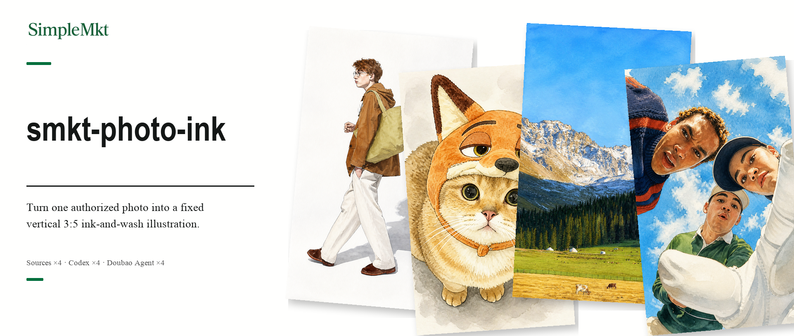
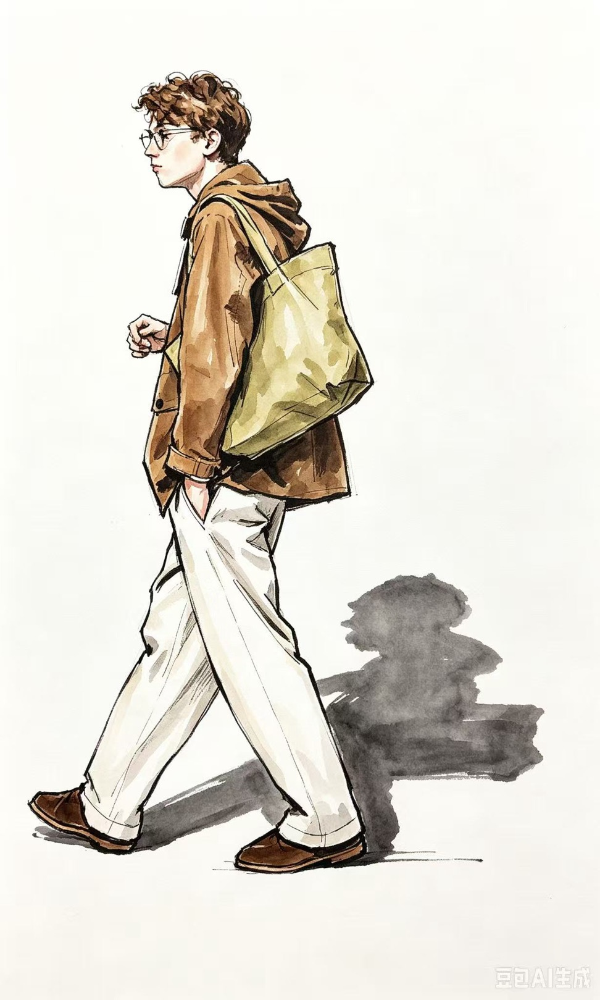
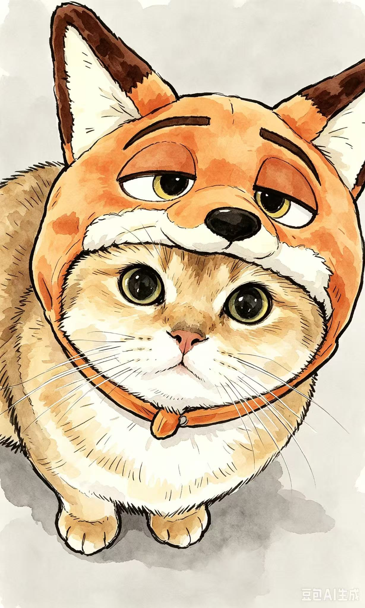
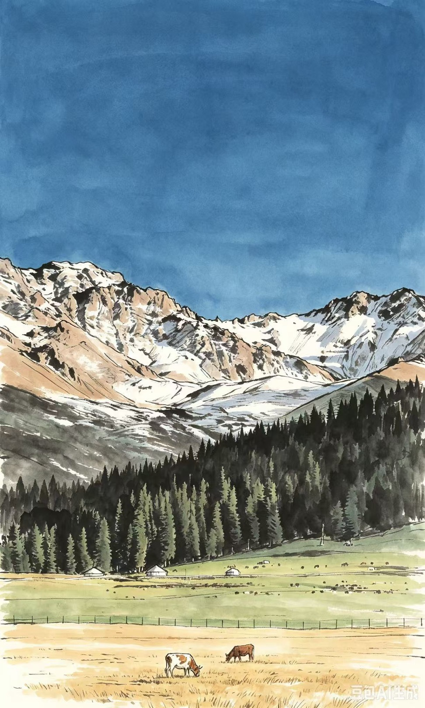
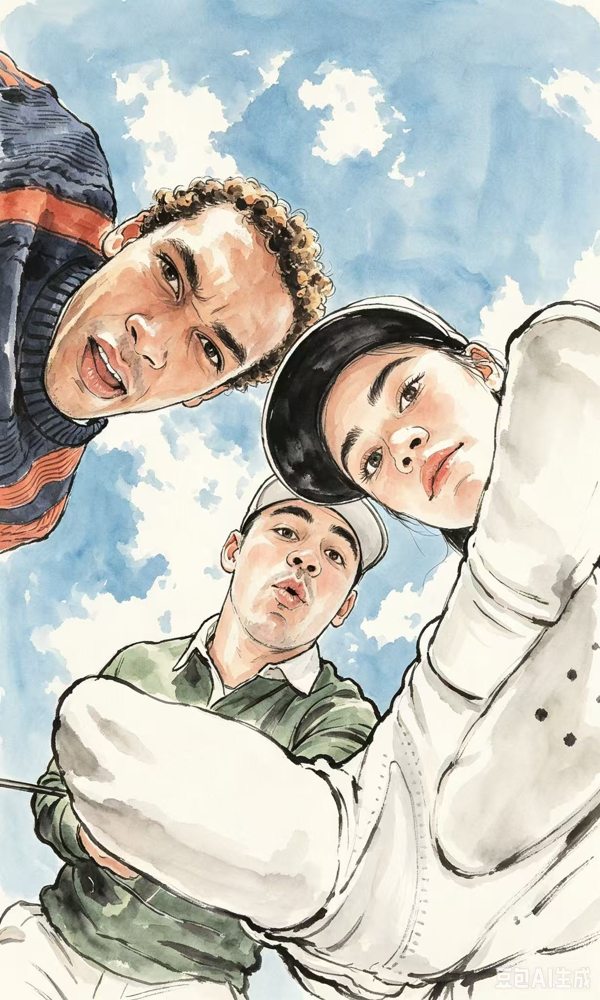

<div align="center">

# smkt-photo-ink

**Turn one authorized photo into a fixed vertical 3:5 ink-and-wash illustration.**

Designed for Codex and image-capable agents.

[SimpleMkt](https://simplemkt.cc) · [X](https://x.com/AlchemistZhou) · [Xiaohongshu](https://www.xiaohongshu.com/user/profile/65a0ecb4000000002201219c) · [Douyin](https://www.douyin.com/user/MS4wLjABAAAArV0uXvsSYl6pD-p5nr-5OFlZED5cEUnb7r2K6j9u4tA)

[Official repository](https://github.com/Lone3m-tech/smkt-photo-ink) · [Runtime contract](SKILL.md)

**[简体中文](README.md) | English**

</div>

## Current status

This is a public source Skill released under the MIT License. The four source/output pairs in `examples/` are owner-approved, AI-generated demonstrations of the fixed treatment.

No GitHub Release tag or ZIP installer has been created. This repository does not claim universal host compatibility.

## Install and tested Agents

Ask your Agent:

> Please install this Skill: https://github.com/Lone3m-tech/smkt-photo-ink

Or run:

```bash
git clone https://github.com/Lone3m-tech/smkt-photo-ink
```

This is a verified public repository path. Your Agent should install it using its native mechanism and report the result; a successful installation only confirms that the files are present. The complete workflow still requires a host that can read the Skill, accept an uploaded image, and perform reference-image editing.

Agents with completed runs:

- **Codex**: verified to read local images, invoke image generation, and deliver a complete vertical 3:5 redraw. The four middle-column results were generated by Codex.
- **Doubao Agent**: run on the same four source images; its original outputs appear in the right column for direct comparison. This demonstrates that it can perform image redraws, not that its fixed-treatment adherence, colour fidelity, or detail control is equivalent to Codex.

Names and observed results state the tested scope only. They do not imply endorsement, partnership, or universal host compatibility.

## Get started

Upload a photo you are authorized to transform, then ask:

> Turn this photo into an ink-and-wash illustration.

The Skill returns one complete scene redraw. If no usable photo is provided, it asks for one instead of inventing a source scene.

## How it works

Photo Ink is a fixed treatment, not a multi-style tool. It redraws people, animals, objects, and backgrounds on a vertical 3:5 canvas in one visual language. When a source ratio differs, it uses quiet scene breathing room to recompose the scene and crops only non-defining empty margins; main subjects, poses, relative scale, key scene anchors, major spatial relationships, and the source photo's dominant and local hues, white balance, cool/warm relationships, relative brightness, and saturation remain.

The treatment uses restrained near-black ink contours, source-faithful watercolour/ink washes, and open breathing room. Colour fidelity takes priority over material effect: it does not apply a global warm, beige, yellow, brown, or sepia colour grade, or bleach or desaturate existing source-derived regions. It has no style, palette, detail, or subject-lock controls.

## What it does

- Input: one photo you are authorized to transform.
- Output: one complete vertical 3:5 ink-and-wash illustration, not a partial filter or collage.
- Preserves: recognisable subject features, clothing or animal markings, scene anchors, the main composition, and the source photo's dominant and local hues, white balance, cool/warm relationships, relative brightness, and saturation. It never crops, deletes, duplicates, or replaces a main subject to force the frame.
- Excludes: photographic cutouts, text, labels, logos, watermarks, borders, extra subjects, and distorted anatomy.

## Use cases

- Hand-drawn portrait reinterpretations.
- Full-scene pet-photo redraws.
- Illustration treatments for an object or everyday scene.
- Unified rendering of travel, landscape, city, or interior photographs.

## Who it is for

Creators, content teams, and brand teams that need a consistent hand-drawn interpretation of an existing portrait, pet, object, or scene photo.

## Not for

- Article visual packages, diagrams, text posters, or generating a new scene without a photo.
- Multiple style, palette, detail, or subject-lock options.
- Pixel-identical photo preservation, identity verification, automated visual QA, retries, or variant selection.
- Background swaps or requests that keep a photorealistic subject untouched.

## Core capabilities

- Full-scene consistency: people, animals, objects, and backgrounds are redrawn in one ink-and-wash language.
- Source colour fidelity first: the treatment fixes the output at vertical 3:5 while retaining subject count, poses, relative scale, major spatial relationships, source hues, white balance, cool/warm relationships, relative brightness, and saturation. It does not apply a global warm, beige, yellow, brown, or sepia colour grade; only quiet breathing room or non-defining empty margins adapt the frame.
- Recognisable interpretation: silhouettes, clothing, markings, and scene anchors support recognition without pixel-level copying.

## Complete demo

The English header banner, `examples/readme-banner.en.png`, is a deterministic unframed collage assembled from the four current Codex results regenerated with the fixed `SKILL.md` treatment. It helps preview the treatment's range, but does not replace the complete source, Codex, and same-source Doubao Agent comparisons and their boundaries below. The included sets are owner-approved examples. The source photos were authorized for this demonstration; the fixed vertical 3:5 Codex results are AI-generated examples. They show the intended treatment, not a guarantee for every image, model, or host.

| Source | Codex result | Doubao Agent result |
| --- | --- | --- |
|  |  |  |
|  |  |  |
|  |  |  |
|  |  |  |

The middle column contains Codex results. The right column contains user-provided Doubao Agent outputs from the same source images, shown only for visual comparison with their original generation marks retained; they are not Codex outputs or performance commitments.

## Dependencies and limitations

- Requires image input, Skill instruction reading, and reference-image editing in the host; it does not guarantee support for every host or image model.
- If image editing is unavailable, the Skill reports the blocker instead of inventing an output.
- You are responsible for source-image copyright, portrait, and privacy permissions, and for complying with the terms of the image service you use.
- This is not photo restoration, identity verification, or a guarantee of copyright, privacy, or output-use rights.

## License

[MIT](LICENSE). Contributions and issue reports are welcome through GitHub.
