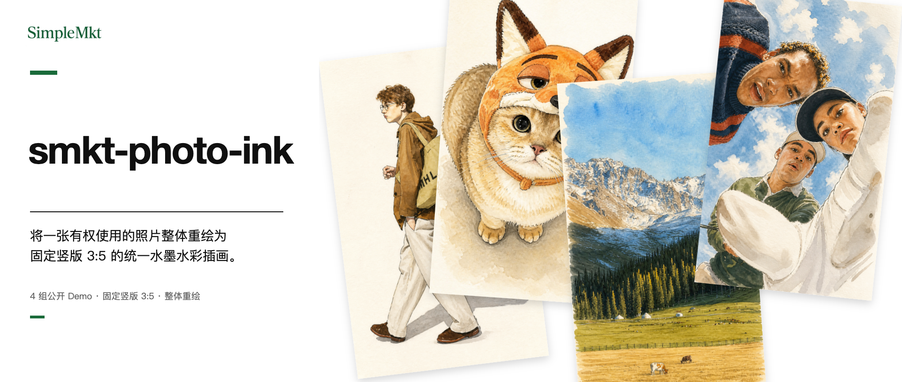
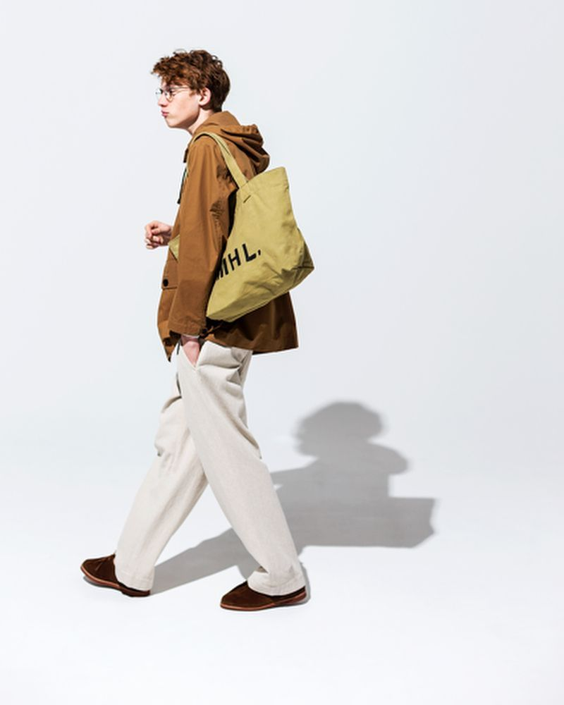
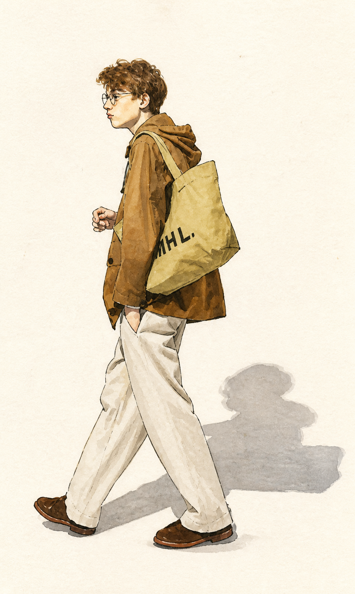
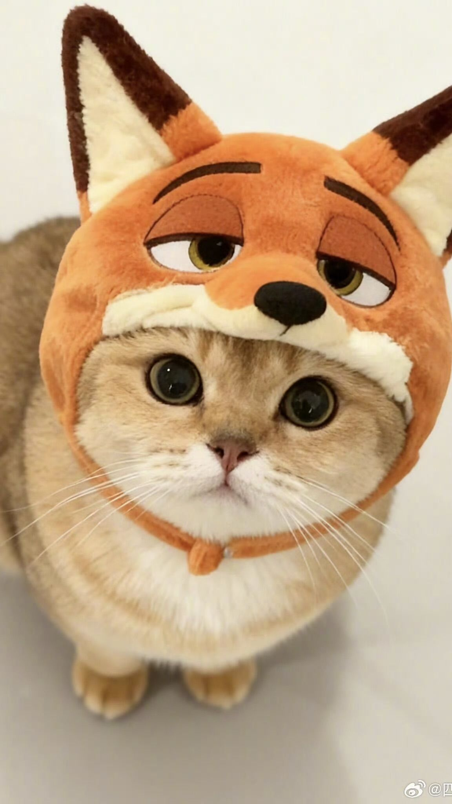
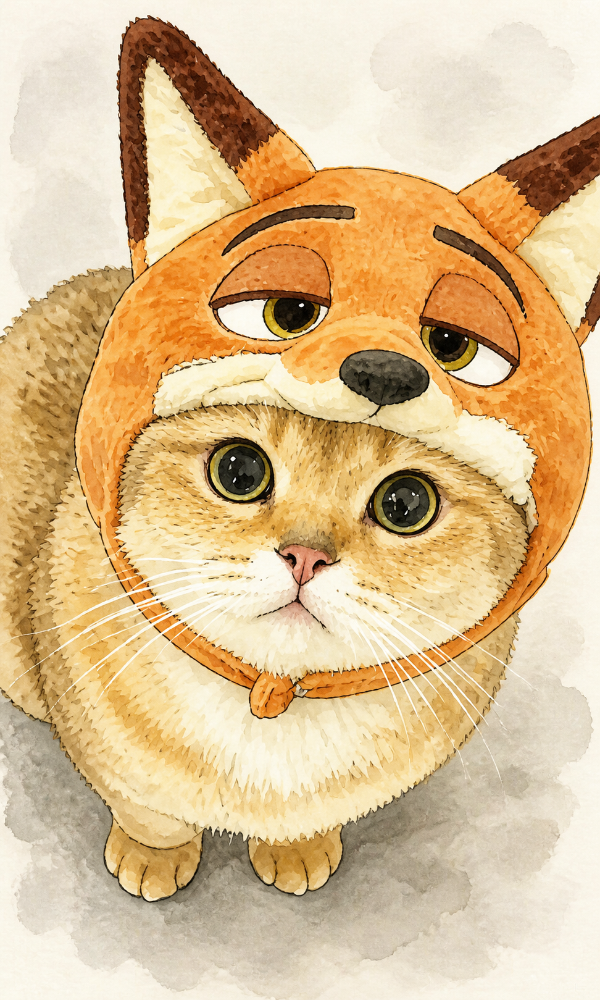
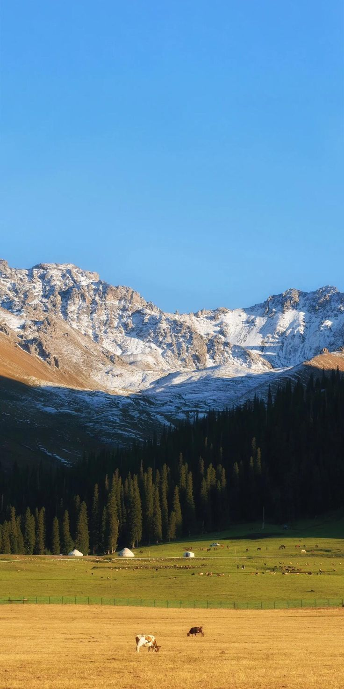
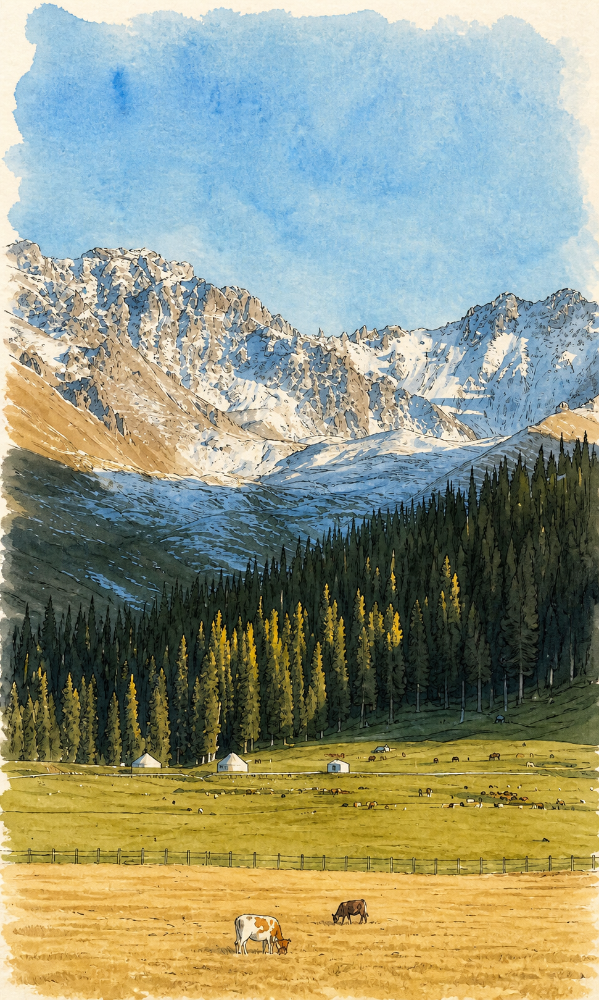
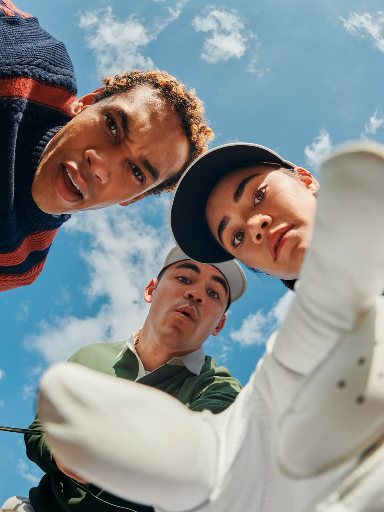
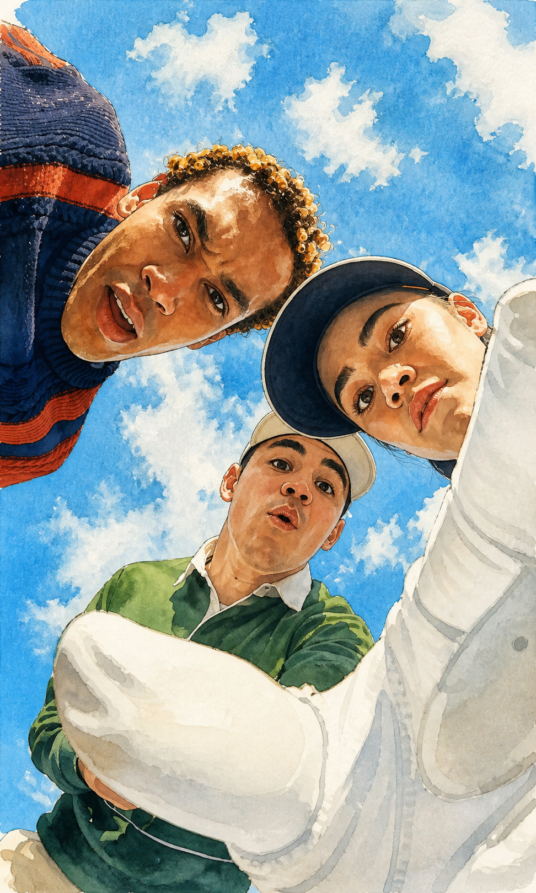

# Photo Ink

> 将一张有权使用的照片整体重绘为固定竖版 3:5 的统一水墨水彩插画，保留主体可辨认特征、关键场景关系与来源色彩关系。

[GitHub 仓库](https://github.com/Lone3m-tech/smkt-photo-ink) · [English](README.md)

## 当前状态

这是一个采用 MIT License 的公开源码 Skill。`examples/` 中的四组输入输出对，是使用者确认的、用于展示固定处理效果的 AI 生成 Demo。

当前尚未创建 GitHub Release tag 或 ZIP 安装附件，也不宣称通用宿主兼容。

## 安装

在支持从 GitHub 安装 Agent Skills 的宿主中，请输入：

> 请帮我安装这个 Skill：https://github.com/Lone3m-tech/smkt-photo-ink

宿主需要能够读取 Skill、接收上传图片并完成参考图编辑；实际可用性取决于该宿主。

## 开始使用

上传一张你有权使用的照片，然后说：

> 把这张照片水墨风格化。

一次请求交付一张完整重绘图。没有可用照片时，Skill 会要求补充图片，而不会凭文字虚构原场景。

## 如何工作

这不是多风格工具。它以固定处理把画面中的人物、动物、物件与背景一起重绘为竖版 3:5。来源图比例不同时，画面以安静的纸面或场景延展重新适配，只裁掉无定义意义的空白边缘；主体、姿势、相对位置、关键场景锚点与主要色彩关系都会保留。

画面使用干净的浅白纸张、克制的近黑墨线和半透明的原图色系水彩，并保留足够留白。它不提供风格、配色、细节等级或主体锁定开关。

## 它做什么

- 输入：一张用户提供且有权使用的照片。
- 输出：一张固定竖版 3:5 的完整水墨水彩重绘图，不是局部滤镜或拼贴。
- 重点保留：主体的可辨认特征、服装或动物花纹、场景锚点、主要构图与来源图的主要色彩关系；不会为了画幅裁掉、删除、复制或替换主体。
- 明确排除：遗留写实人物、动物、物件或背景切片；文字、标签、Logo、水印与边框。

## 用在哪些场景

- 个人人像的统一手绘化。
- 宠物照片的全场景水墨水彩重绘。
- 单一物件与日常生活场景的插画化。
- 山野、城市或室内照片的统一视觉处理。

## 适合谁

希望把人物、宠物、物件或场景照片转为统一手绘插画的个人创作者、内容团队与品牌团队。

## 不适合谁

- 需要文章配图包、信息图、文字海报，或没有照片时生成新场景的人。
- 需要多种风格、配色、细节等级或主体锁定开关的人。
- 需要像素级照片保真、人物身份验证、人工质检、自动重试或多版本挑选的人。
- 只想更换背景，或要求保留原始写实主体的人。

## 核心能力

- 全场景一致：人物、动物、物件与背景都进入同一种水墨水彩语言。
- 原图关系优先：固定输出竖版 3:5，不任意改变主体数量、姿势、相对关系或来源色彩家族；仅以留白或无定义空白边缘适配画幅。
- 可辨认而非像素复刻：通过轮廓、服装、动物花纹与场景锚点维持识别特征。

## 完整 Demo

中文顶部横幅 `examples/readme-banner.zh-CN.png` 以四张公开 Ink Demo 的未改写、无边框缩略图组成产品总览。它帮助预览固定处理的适用范围，但不替代下方完整的来源图/Ink 结果配对及其边界说明。以下四组才是使用者确认的 Demo。来源照片已获用于该展示的授权，Ink 结果均为固定竖版 3:5 的 AI 生成示例。它们展示固定处理的预期效果，不保证其他图片、模型或宿主得到相同结果。

| 来源图 | Ink 结果 |
| --- | --- |
|  |  |
|  |  |
|  |  |
|  |  |

## 依赖与限制

- 运行时需要图片输入、Skill 指令读取与等效参考图编辑能力；不保证所有宿主或图像模型兼容。
- 若图像编辑能力不可用，Skill 会说明失败，不会假装已生成结果。
- 使用者负责确认来源照片的版权、肖像与隐私许可，并核对所选图像模型的适用条款。
- 这不是照片修复、身份验证，也不保证版权、隐私或生成结果的使用权。

## License

[MIT License](LICENSE)。欢迎通过 GitHub 提交 Issue 或贡献。
